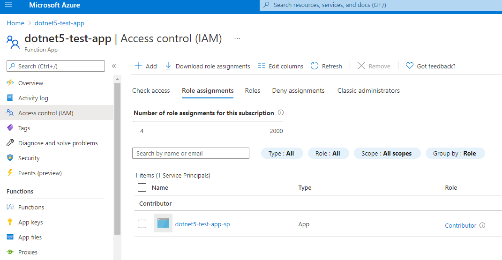

# Azure Functions .NET 5 Sample Project
Sample GitHub Actions CI/CD Pipeline for Azure Function .NET 5 Isolated Process.

Public docs for Azure Functions with the new .NET 5 isolated process setup can be found below,

https://docs.microsoft.com/en-us/azure/azure-functions/dotnet-isolated-process-guide

The public GitHub repo for the Azure Functions dotnet Worker is below,

https://github.com/Azure/azure-functions-dotnet-worker

And the public GitHub repo for the Azure Functions Core commandline tooling can be found here,

https://github.com/Azure/azure-functions-core-tools

## Setup Notes

1. Clone/fork this repo
2. Create a local file in the root of the Sample.FunctionApp project ```local.settings.json```. There is a ```.gitignore``` setting to not check this file into source code. A sample ```local.settings.json``` is below.  You can also download a full sample [here](misc/local.settings.json).
```json
{
    "IsEncrypted": false,
    "Values": {
        "AzureWebJobsStorage": "",
        "FUNCTIONS_WORKER_RUNTIME": "dotnet-isolated"
    }
}
```
3. Create an Azure Function resource in your own Azure subscription.  Public docs on how to do this can be found [here](https://docs.microsoft.com/en-us/azure/azure-functions/functions-create-function-app-portal#create-a-function-app).

## Option 1: Deploying with the Azure Function Core Tools

See YAML file ```dotnet2.yml``` [here](.github/workflows/dotnet2.yml).

1. Create an AAD Service Principal that has contribute permissions to the Azure Function resource. Easiest way to do this is to launch the [Azure Cloud Shell](https://docs.microsoft.com/en-us/azure/cloud-shell/overview) in the Azure Portal
```Shell
az ad sp create-for-rbac --name "<FUNCTION_APP_NAME>-sp" --sdk-auth --role contributor --scopes /subscriptions/<SUBSCRIPTION_GUID>/resourcegroups/<RESOURCE_GROUP>/providers/Microsoft.Web/sites/<FUNCTION_APP_NAME>
```

2. Once you complete this, you will see the new Service Principal with an assigned contributor role in the IAM blade for the Azure Function App,



3. Save the entire JSON output of the PowerShell operations to a [GitHub Action Secret](https://docs.github.com/en/actions/reference/encrypted-secrets) with the name ```AZURE_CREDS_FUNCTION_APP```.  This enables you to securely reference this credential in GitHub Actions to authenticate to Azure.
4. Update the ```dotnet2.yml``` file to specify the actual Azure Function resource name you created previously.  Snippet included below, the full YAML file can be found [here](.github/workflows/dotnet2.yml)
```yaml
env:
  AZURE_FUNCTIONAPP_NAME: <ACTUAL_FUNCTION_RESOURCE_NAME> # set this to the name of your azure function app resource
  AZURE_FUNCTION_PROJ_PATH: src/Sample.FunctionApp  # set this to the path to your function app project
  ROOT_SOLUTION_PATH: src # set this to the root path of your solution/project file
```
5. Kick off the GitHub Action to deploy your .NET 5 Isolated Process Azure Function App!

## Option 2: Deploying with Azure Functions GitHub Action

See YAML file ```dotnet.yml``` [here](.github/workflows/dotnet.yml).

1. Go to your Azure Function App overview blade.  Download the publish profile.  Open up the txt file and copy the entire contents.  


2. Save the contents as a GitHub Action Secret titled ```AZURE_FUNCTION_PUBLISH_CREDS```
3. Kick off the GitHub Action to deploy your .NET 5 Isotated Processs Azure Function App!
